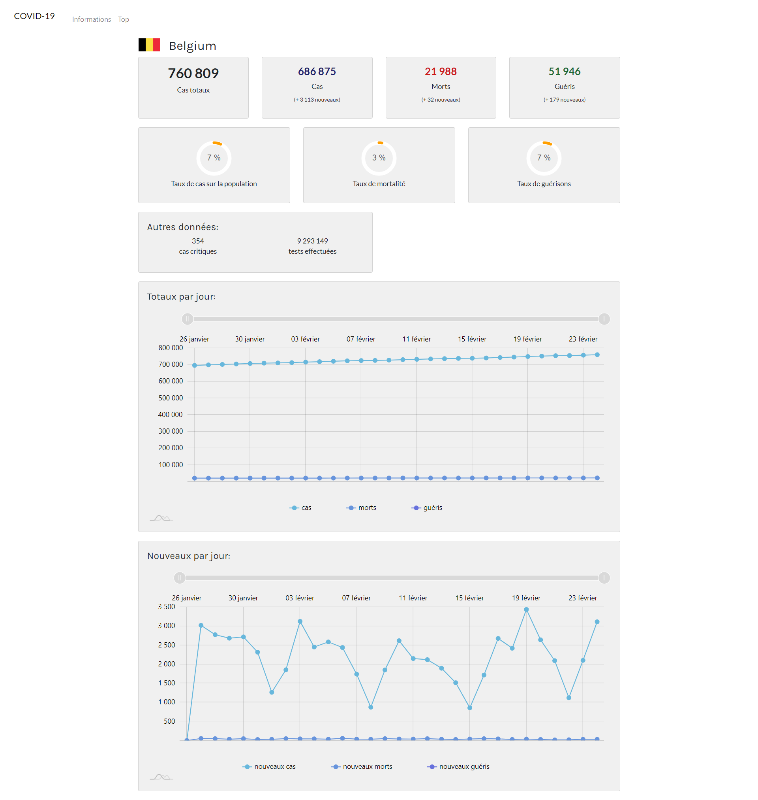
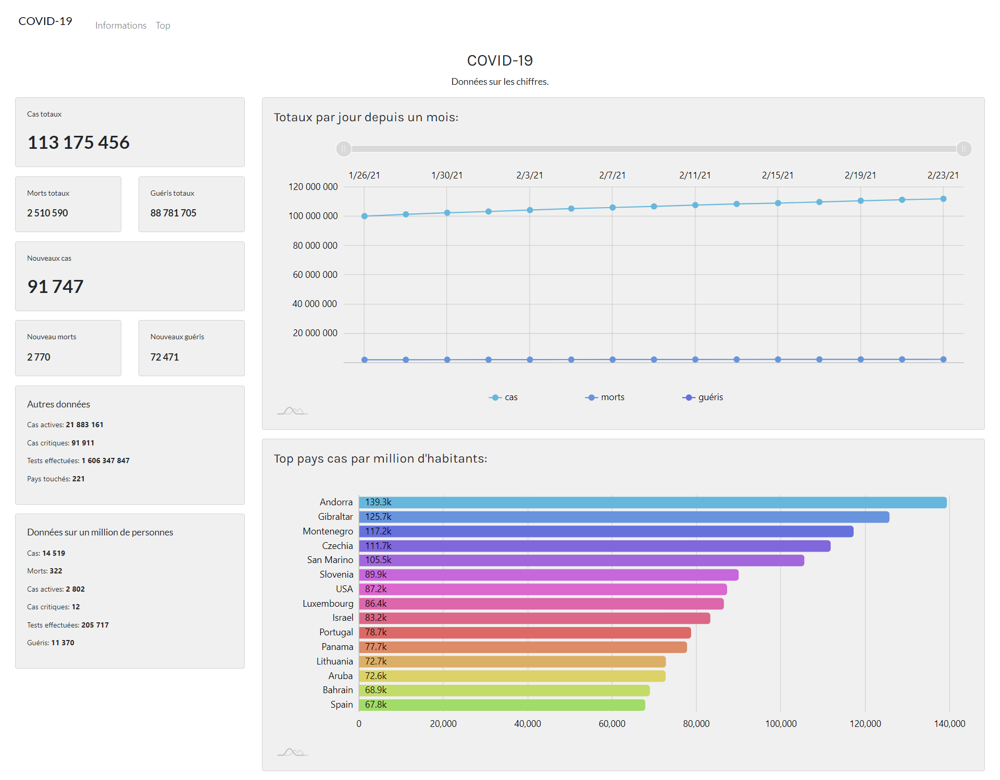
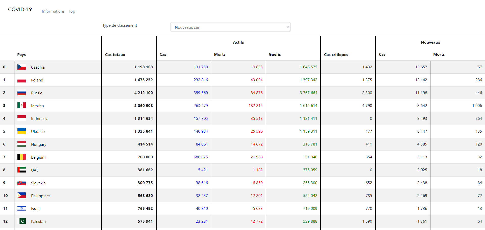
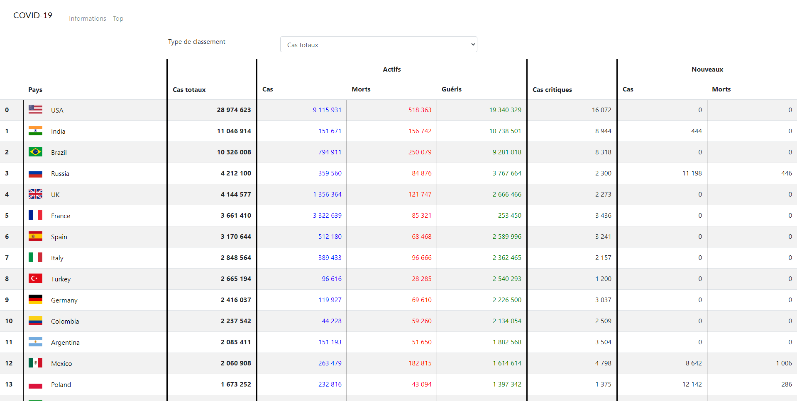

# But
Ce projet a été réalisé pour moi-même.
# Concept
Afficher les données du COVID-19. Une page avec les chiffres totaux du monde. Sur une autre page, afficher le top via des classements, et pouvoir avoir un aperçu des données de chaque pays.
# Langages / librairies utilisés
* HTML
* CSS
* Bootstrap
* PHP
* API
* Amchart
* JavaScript
# Réalisations
Afficher les chiffres totaux, l'évolution des chiffres totaux depuis un mois, les pays avec le plus de cas.
Afficher le top via des classements qu'on peut choisir
Avoir une page pour chaque pays, où j'affiche les chiffres totaux + un graphique avec les cas / morts / guéris totaux sur le dernier mois, et l'autre graphique les cas / morts / guéris chaque jour

# Site
## Accueil
Les informations générales sont affichées.
Nous pouvons  y retrouver:
* les chiffres totaux
* un graphique des totaux par jour depuis un mois
* un graphique du top des pays avec le plus de cas par million d'habitants

## Top
Affichage de tout les pays avec plusieurs informations. Possibilité de trier via plusieurs choix:
* alphabétique
* cas totaux
* cas actifs
* morts actifs
* guéris actifs
* cas critiques
* nouveaux cas
* nouveaux morts

Classement cas totaux

Classement nouveaux cas

## Pays
Affichage des informations d'un pays.
Nous pouvons y retrouver:
* les chiffres totaux
* un graphique des nouveaux cas, morts, guéris par jour depuis un mois
* un graphique des cas totaux par jour depuis un mois

